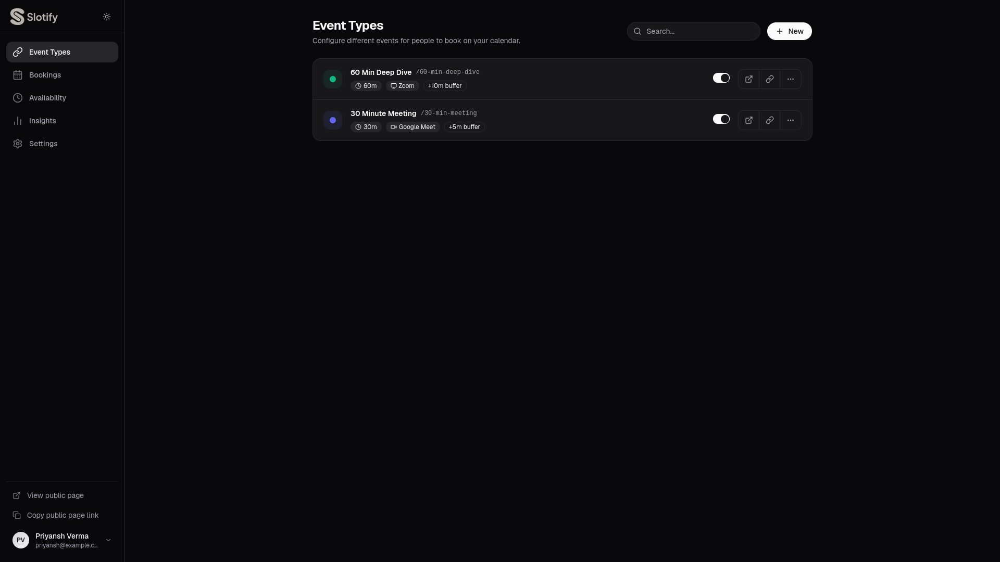
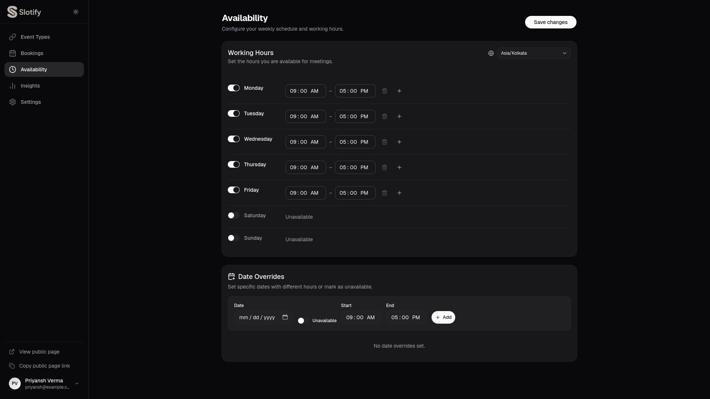

# Slotify — Scheduling Platform (Cal.com Clone)

Slotify is a full-stack scheduling and booking web application built as a clone of Cal.com. It allows users to create event types, set their availability, and share public booking links for others to seamlessly book time slots on their calendar.

## 🚀 Deployment Links
- **Frontend**: https://slotify-app.vercel.app/
- **Backend API**: https://slotify-backend.vercel.app

## ✨ Features
- **Event Types Management**: Create, edit, toggle visibility, and delete event types with unique public URLs.
- **Availability Settings**: Configure weekly working hours and timezones.
- **Public Booking Interface**: A responsive calendar view that calculates available slots dynamically and prevents double-booking.
- **Bookings Dashboard**: View upcoming/past meetings and cancel bookings.
- **Bonus Features Included**:
  - Fully responsive design (Mobile, Tablet, Desktop)
  - Buffer time configuration automatically applied between meetings
  - Date Overrides (block off specific holidays/vacations or set custom hours per day)
  - Glassmorphic, highly polished UI matching Cal.com's modern design language
  - Dark mode support

## 🛠 Tech Stack
- **Frontend**: React.js (Vite), Tailwind CSS v4, shadcn/ui (Radix Primitives), Lucide Icons, Date-fns
- **Backend**: Node.js, Express.js, Prisma ORM
- **Database**: PostgreSQL (Hosted on Neon — configured via Prisma ORM)

## 🏗 Architecture
The application follows a standard client-server architecture:
- **Frontend**: A Single Page Application (SPA) built with React and Vite. It handles routing, UI state, and API communication.
- **Backend**: A RESTful API built with Node.js and Express. It serves as the bridge between the frontend and the database, implementing business logic and validation.
- **Database**: PostgreSQL database hosted on Neon, accessed and managed using Prisma ORM.

## 🗄 Database Schema
The database consists of three main models:
- **EventType**: Stores different types of meetings (e.g., 15-min chat, 30-min interview), including their duration, location, color, buffer time, and slug.
- **Availability**: Stores the user's weekly working hours and timezone, along with date-specific overrides.
- **Booking**: Records scheduled meetings, linking to an `EventType`. It stores attendee details, booking date, start/end times, and status (upcoming/cancelled).

## 🔌 API Endpoints
### Event Types
- `GET /api/event-types` - Get all event types
- `POST /api/event-types` - Create a new event type
- `PUT /api/event-types/:id` - Update an event type
- `DELETE /api/event-types/:id` - Delete an event type
- `GET /api/event-types/slug/:slug` - Get an event type by slug

### Availability
- `GET /api/availability` - Get the availability schedule
- `POST /api/availability` - Create or update the availability schedule

### Bookings
- `GET /api/bookings` - Get all bookings
- `GET /api/bookings/slots` - Get available time slots for a given date and event type
- `POST /api/bookings` - Create a new booking
- `PATCH /api/bookings/:id/cancel` - Cancel an existing booking

## ⚙️ Setup Instructions

### 1. Clone the repository
```bash
git clone <your-repo-url>
cd cal-clone
```

### 2. Backend Setup
```bash
cd backend
npm install

# Set up the PostgreSQL database
# (Ensure DATABASE_URL is set in your .env file)
npx prisma db push

# Seed the database with sample data
node prisma/seed.js

# Start the development server
npm run dev
```
*The backend will run on `http://localhost:5000`*

### 3. Frontend Setup
Open a new terminal window:
```bash
cd frontend
npm install

# Start the Vite development server
npm run dev
```
*The frontend will run on `http://localhost:5173`*

## 🔐 Environment Variables
To run this project, you will need to add the following environment variables to your `.env` files.

### Backend (`backend/.env`)
- `DATABASE_URL`: Connection string for your PostgreSQL database.
- `PORT`: (Optional) Port for the backend server (defaults to 5000).

### Frontend (`frontend/.env`)
- `VITE_API_URL`: URL of the backend API (e.g., `http://localhost:5000/api`).

## 📸 Screenshots
- Event Types View

- Availability Settings

- Public Booking Page


## 🤔 Assumptions
- **No Authentication**: As per the requirements, no login system is implemented. A default user context is assumed for the admin side, and the public booking page is accessible to anyone.
- **Database**: PostgreSQL (Neon) is used as the primary database, satisfying the assignment's explicit relational database requirement. Prisma ORM handles all migrations and querying.
- **Double Booking Prevention**: Handled at both the frontend (by dynamically stripping booked slots from the UI) and the backend (via a concurrency check before saving to the database).

## 📄 License
MIT
